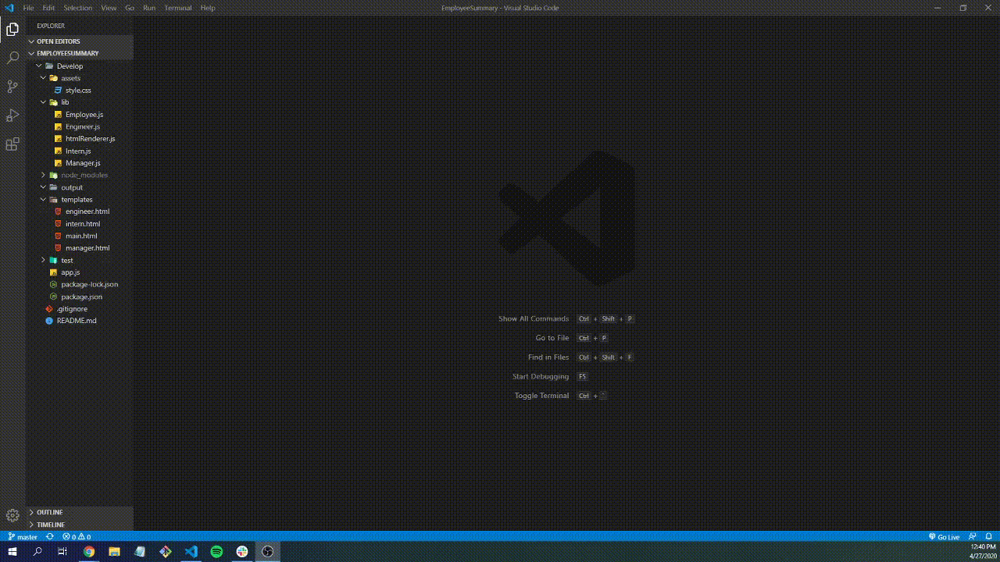

# Welcome to Employee Summary by Joy

  
  
## Description
  
This project will assist in creating team profiles for employers. It will create cards to showcase your employee's names, ID #s, emails, and depending on their position, either their office number, gitHub profile, or school they attend. This application is mostly powered by jQuery but has some HTML and CSS elements to develop the webpage. 

## User Story

As a manager, I want to write a team profile page, so that my team's information is showcased.

  
## Table of Contents
* [Installation](#installation)
* [Usage](#usage)
* [License](#license)
* [Contributors](#contributing)
* [Tests](#tests)
* [Questions](#questions)

  
## Installation

To use this application, run the following commands in your terminal to install the appropriate packages

* npm i inquirer
* npm i jest

* or just run npm install

## Usage 

After you've installed the packages, in order for the application for work please run node app.js in your terminal and follow the prompts given.

## Tests
To test this application, use command 

    npm run test

## Demo

## Questions
  
If you see any improvements that can be made, please email me at joychen5069@gmail.com. You can also visit my GitHub page at https://github.com/joychen5069 or visit the Employee Summary page at https://github.com/joychen5069/EmployeeSummary

  